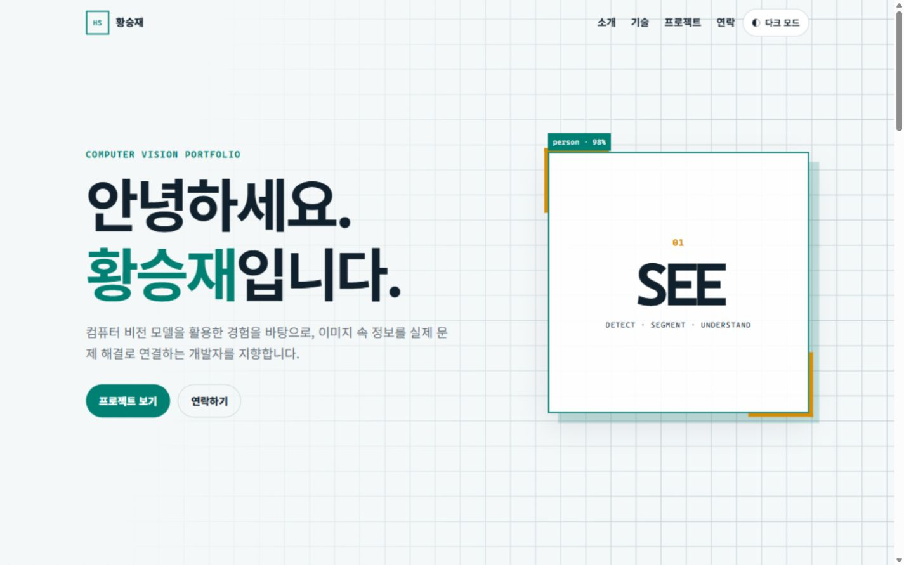
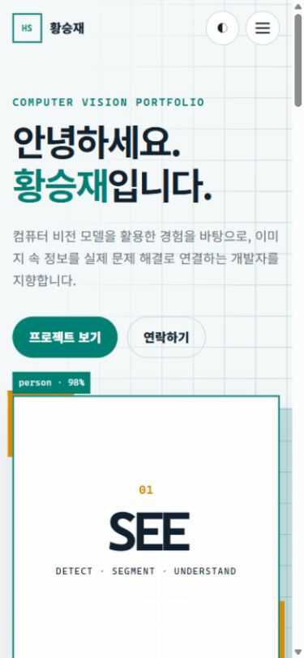
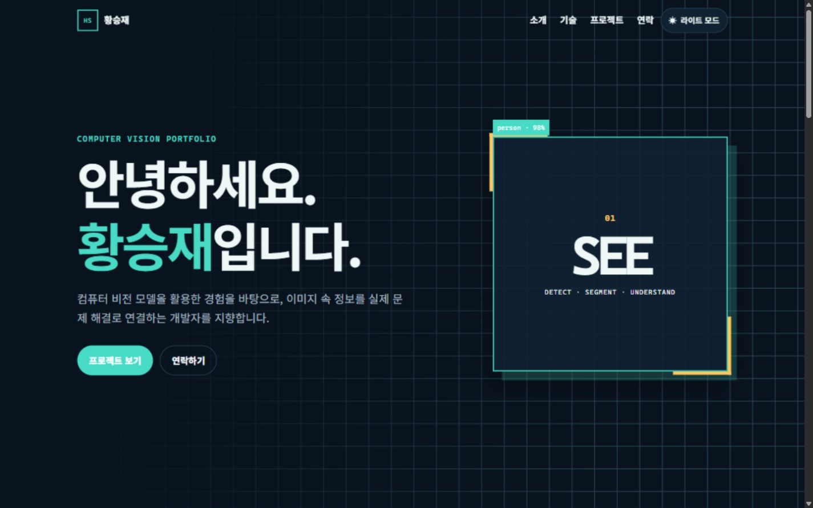

# 황승재 Computer Vision Portfolio

순수 HTML, CSS, JavaScript로 만든 반응형 개인 포트폴리오입니다. 컴퓨터 비전 관심 분야와 기술 스택을 소개하고, GitHub API에서 공개 저장소를 가져와 프로젝트 카드로 렌더링합니다.

## 배포 주소

- GitHub 저장소: <https://github.com/bidulgiya999/codyssey_B1-1>
- GitHub Pages: <https://bidulgiya999.github.io/codyssey_B1-1/>

> GitHub Pages 주소는 저장소의 Pages 배포 설정을 완료한 후 활성화됩니다.

## 사용 기술

- HTML5 시맨틱 마크업
- CSS3 변수, Flexbox, Grid, 미디어 쿼리
- Vanilla JavaScript DOM API
- GitHub REST API
- Local Storage
- Intersection Observer

외부 UI 라이브러리와 JavaScript 프레임워크는 사용하지 않았습니다.

## 실행 방법

### VS Code Live Server

1. VS Code에서 이 폴더를 엽니다.
2. `index.html`을 선택합니다.
3. 상태 표시줄의 **Go Live**를 누르거나 `Open with Live Server`를 실행합니다.

### Python 간이 서버

Live Server가 없으면 터미널에서 다음 명령을 실행합니다.

```powershell
python -m http.server 5500
```

브라우저에서 <http://localhost:5500>에 접속합니다. `file://`로 직접 열기보다 HTTP 서버를 사용해야 GitHub API 동작을 같은 환경에서 확인하기 쉽습니다.

## 폴더 구조

```text
codyssey_B1-1/
├── index.html
├── css/
│   └── style.css
├── js/
│   └── script.js
├── images/
│   ├── profile.png
│   └── screenshots/
│       ├── desktop.png
│       ├── mobile.png
│       └── dark-mode.png
├── .gitignore
└── README.md
```

## 주요 기능

### 반응형 레이아웃

- 모바일 우선으로 기본 스타일 작성
- 태블릿 브레이크포인트: `768px`
- 데스크톱 브레이크포인트: `1024px`
- 내비게이션에는 Flexbox 사용
- 프로젝트 카드에는 `repeat(auto-fit, minmax(...))` Grid 사용

### 상태 → 렌더링 흐름

`js/script.js`의 `state` 객체에 화면 상태를 모아 다음 흐름이 코드에서 드러나도록 구성했습니다.

1. 테마 버튼 클릭 → `state.theme` 변경 → `data-theme`와 버튼 문구 변경
2. 햄버거 버튼 클릭 → `state.menuOpen` 변경 → 메뉴 클래스와 ARIA 속성 변경
3. GitHub API 호출 → `loading/success/error` 상태 변경 → Projects UI 변경
4. 언어 필터 클릭 → `activeLanguage` 변경 → 필터링된 프로젝트 카드 렌더링
5. 폼 입력 → 값과 오류 상태 변경 → 필드 근처 오류 메시지 변경

### 다크 모드

- 루트 요소의 `data-theme` 속성으로 CSS 변수를 전환합니다.
- 사용자 선택을 `localStorage`의 `portfolio-theme` 키에 저장합니다.
- 저장된 선택이 없을 때만 시스템의 `prefers-color-scheme`을 초기값으로 사용합니다.

### 스크롤 인터랙션

- 스크롤 `60px` 이상: 헤더 배경과 그림자 표시
- 스크롤 `300px` 이상: 맨 위로 이동 버튼 표시
- Intersection Observer 임계값: `0.2`
- `prefers-reduced-motion` 사용자는 애니메이션을 최소화합니다.

### 문의 폼

- 이름, 이메일, 메시지 필수 검증
- 이메일 정규식 검사
- 메시지 최소 10자 검사
- `input` 이벤트로 입력 중 실시간 오류 갱신
- `submit` 이벤트에서 `preventDefault()`를 호출하고 성공 상태 표시

현재 폼은 프론트엔드 유효성 검사 학습용이며 실제 메일을 전송하지 않습니다. 실제 전송은 Formspree 또는 EmailJS 연동이 필요한 선택 보너스입니다.

## GitHub API

호출 주소:

```text
https://api.github.com/users/bidulgiya999/repos?sort=updated&per_page=100
```

구현된 상태 UI:

- 로딩: 스피너와 안내 문구
- 성공: 최근 공개 저장소 최대 6개
- 에러: 오류 원인과 다시 시도 버튼
- 빈 상태: 공개 저장소가 없다는 안내
- 403: 비인증 API 요청 한도 초과 안내
- 10초 초과: 요청 시간 초과 안내

GitHub API의 비인증 요청은 IP 기준 시간당 60회로 제한될 수 있으므로 개발 중 반복 새로고침을 피합니다.

외부 API 문자열은 `innerHTML`에 넣기 전에 `escapeHtml()`로 이스케이프합니다. 저장소 링크도 `https://github.com/`으로 시작하는지 확인합니다.

## ES6+ 문법 사용 예

- 화살표 함수: 이벤트 처리와 렌더링 함수
- 템플릿 리터럴: GitHub API URL 및 동적 카드 HTML
- 구조분해 할당: API 응답과 폼 이벤트 값 추출
- `map()`: 저장소 데이터 정규화와 카드 HTML 생성
- `filter()`: 언어 필터와 빈 언어 제거
- `forEach()`: 메뉴 링크, 폼 필드, Observer 연결
- `async/await`: GitHub API 요청
- `try/catch/finally`: API와 localStorage 예외 처리

## 스크린샷

### 데스크톱



### 모바일



### 다크 모드



## GitHub Pages 배포

1. 저장소에 코드를 `push`합니다.
2. GitHub 저장소의 **Settings → Pages**로 이동합니다.
3. **Build and deployment**의 Source를 **Deploy from a branch**로 선택합니다.
4. Branch를 `main`, 폴더를 `/(root)`로 지정하고 저장합니다.
5. 배포 완료 후 Pages URL에서 반응형, API, 다크 모드, 폼을 다시 확인합니다.

모든 CSS·JavaScript·이미지 경로는 GitHub Pages의 프로젝트 하위 경로에서도 동작하도록 상대 경로로 작성했습니다.

